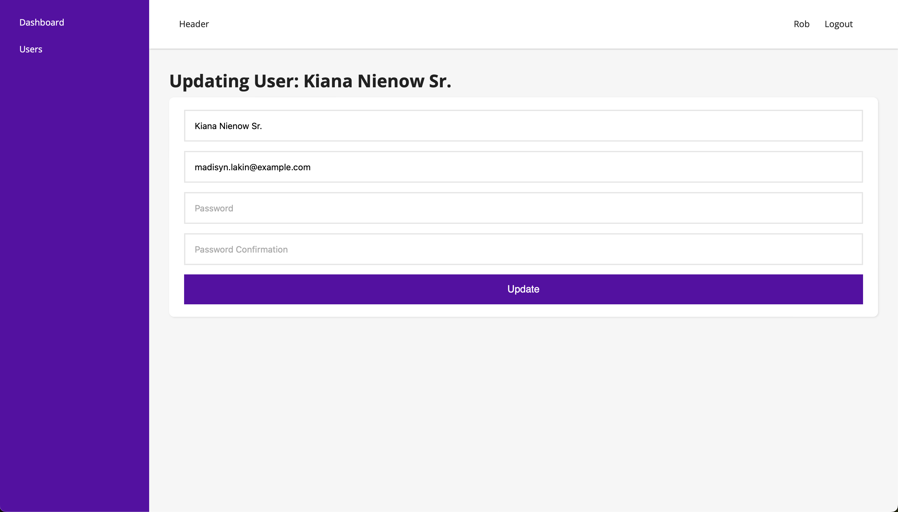

## Laravel & React | Full-stack


**User Management Application with Laravel and React**

This web application allows you to manage users, including registration, editing, deleting, and viewing details. It is built using the following technologies:

* **Laravel:** A PHP framework for fast and robust web development.
* **React:** A JavaScript library for creating interactive user interfaces.

**Features:**

* **User Registration:** Create new users with name, email, and password.
* **User Editing:** Edit the information of existing users.
* **User Deletion:** Remove users from the application.
* **Details View:** View the complete information for each user.

**Requirements:**

* **PHP:** Version 7.4 or higher.
* **Composer:** PHP dependency manager.
* **Node.js:** JavaScript execution environment for front-end development.
* **npm:** JavaScript package manager.

**Installation:**

1. Clone the application repository:

```bash
git clone https://github.com/rob-ec/laravel-react-full-stack.git
```

2. Access the application directory and Install Laravel dependencies:

```bash
composer install
```

3. Generate an application key:

```bash
php artisan key:generate
```

4. Run Seed
```bash
php artisan db:seed
```

5. Install React dependencies on react folder ([/react](/react/)):

```bash
npm install
```

6. Run the Laravel development scripts:

```bash
php artisan serve
```

7. Run the React development scripts on react folder ([/react](/react/)):

```bash
npm run dev
```

8. Access the application in your browser:

```
http://localhost:3000
```

**Usage:**

* **User Registration:**
    1. Access the user registration page (`/signup`).
    2. Fill in the fields with the user's information.
    3. Click the "Signup" button.

* **User Auth**
    1. Access the user login page (`/login`)
    2. Fill in the fields with the user's information.
    3. Click the "Login" button.

* **User Editing:**
    1. Access the list of users.
    2. Click the "Edit" button of the user you want to edit.
    3. Fill in the fields with the new user information.
    4. Click the "Update" button.

* **User Deletion:**
    1. Access the list of users.
    2. Click the "Delete" button of the user you want to remove.
    3. Confirm the deletion by clicking the "Yes" button.

**Notes:**

* This application is just a basic example and can be expanded to include other features, such as permission management and email sending.
* For more information about Laravel, please refer to the official documentation: [https://laravel.com/](https://laravel.com/).
* For more information about React, please refer to the official documentation: [https://legacy.reactjs.org/](https://legacy.reactjs.org/).

## Demo


